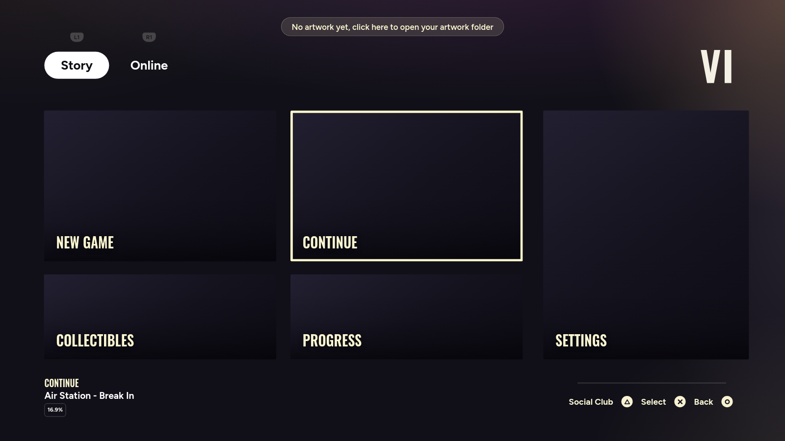
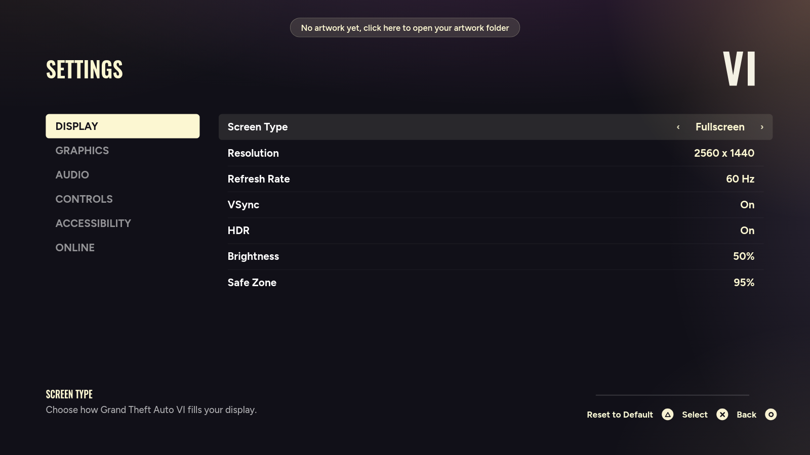
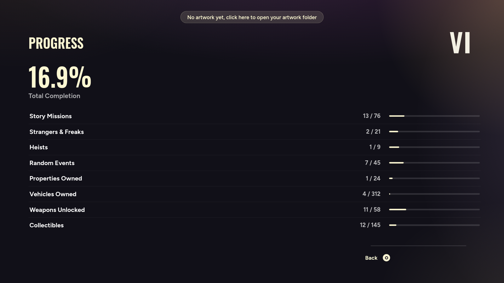

# Grand Theft Auto VI: Main Menu Mockup

Fanowska atrapa ekranu menu głównego GTA VI. **To nie jest gra**, nie ma w tym
żadnego kodu gry, żadnych plików Rockstara i niczego, co można zagrać. To jeden
ekran zrobiony po to, żeby na kamerce wyglądał jak odpalona gra.

> **Disclaimer** · Unofficial fan mockup. Not a game, not affiliated with
> Rockstar Games or Take-Two Interactive. **No game artwork or logo ships with
> this repository or with any build made from it**. You supply your own images
> at runtime, from a folder on your own machine. "Grand Theft Auto" is a
> trademark of Take-Two Interactive Software, Inc.

<p align="center">
  
</p>

Zrzuty pokazują aplikację **bez grafik**, dokładnie to, co zobaczysz zaraz po
instalacji. Kafelki wypełniasz własnymi zdjęciami (patrz niżej).

<p align="center">
  
  
</p>

---

## 1. Instalacja

### Gotowa aplikacja (bez instalowania niczego)

Pobierz z zakładki [**Releases**](../../releases) paczkę dla swojego systemu:

| System | Plik |
|---|---|
| macOS (Apple Silicon, M1/M2/M3/M4) | `GTA-VI-Menu-macOS-arm64.zip` |
| Windows 10/11 (64-bit) | `GTA-VI-Menu-Windows-x64.zip` |

Rozpakuj i odpal. Aplikacja **nie jest podpisana cyfrowo**, więc system
najpierw zaprotestuje, to normalne dla darmowych narzędzi bez płatnego
certyfikatu:

- **macOS**: otwórz *Ustawienia systemowe → Prywatność i ochrona*, zjedź na dół
  i kliknij **„Otwórz mimo to"** przy nazwie aplikacji. Alternatywnie w
  Terminalu: `xattr -dr com.apple.quarantine "Grand Theft Auto VI.app"`
- **Windows**: przy niebieskim okienku SmartScreen kliknij **„Więcej informacji"**,
  potem **„Uruchom mimo to"**

### Z kodu

Potrzebujesz [Node.js](https://nodejs.org) 18+.

```bash
git clone https://github.com/Damikk19/gta6-fake-main-menu.git
cd gta6-fake-main-menu
npm install
npm start
```

Nowsze wersje npm blokują skrypty instalacyjne paczek i wypisują ostrzeżenie
`allow-scripts`. Jeśli `npm start` padnie z komunikatem, że Electron nie
zainstalował się poprawnie, dociągnij go ręcznie:

```bash
node node_modules/electron/install.js
```

---

## 2. Wrzucenie grafik

Aplikacja startuje z pustymi kafelkami. Kliknij **napis u góry ekranu**
(albo w menu *Grand Theft Auto VI → Artwork Folder…*), a otworzy się folder,
do którego wrzucasz zdjęcia:

- **macOS**: `~/Library/Application Support/Grand Theft Auto VI/artwork`
- **Windows**: `%APPDATA%\Grand Theft Auto VI\artwork`

Wrzuć tam pliki o takich nazwach (`.png`, `.jpg`, `.jpeg`, `.webp` lub `.avif`):

| Plik | Gdzie ląduje |
|---|---|
| `new-game` | duży kafelek, lewy górny |
| `continue` | duży kafelek, środek (**też tło ekranu ładowania**) |
| `settings` | wysoki kafelek po prawej |
| `collectibles` | mały kafelek, lewy dolny |
| `progress` | mały kafelek, środkowy dolny |
| `vi-logo` | opcjonalne logo w prawym górnym rogu (musi mieć przezroczyste tło) |

Najlepiej wyglądają zdjęcia 16:9 w rozdzielczości 1920×1080 lub większej.
Po wrzuceniu **zrestartuj aplikację**. Bez `vi-logo` w rogu wyświetli się
zwykły napis „VI".

Skąd wziąć grafiki? To już Twoja decyzja i Twoja odpowiedzialność. Może to być
cokolwiek: oficjalne materiały prasowe, zrzuty z zwiastuna, własne zdjęcia,
memy. Aplikacji jest wszystko jedno.

---

## 3. Sterowanie

| Klawisz | Akcja |
|---|---|
| `←` `→` `↑` `↓` albo `WASD` | poruszanie się |
| `Enter` / `Spacja` | wybór |
| `←` `→` w ustawieniach | zmiana wartości opcji |
| `Q` / `E` albo `Tab` | Story ↔ Online, w ustawieniach zmiana kategorii (L1/R1) |
| `Esc` / `Backspace` | powrót do menu |
| `R` w ustawieniach | przywróć domyślne w kategorii |
| `F11` (Win) · `Ctrl`+`Cmd`+`F` (Mac) | **pełny ekran, włącz to przed nagrywaniem** |

Kursor myszy znika po 1,5 s bezruchu, żeby obraz był czysty. Zaznaczenie nie
przeskakuje samo, gdy okno otworzy się pod kursorem.

---

## 4. Co jest w środku

Żaden kafelek nie jest ślepy:

| Kafelek | Efekt |
|---|---|
| CONTINUE / PLAY ONLINE / QUICK JOIN / CREATOR | ekran ładowania |
| NEW GAME | okno potwierdzenia → ładowanie |
| SETTINGS | 6 kategorii, 45 regulowanych opcji |
| PROGRESS / COLLECTIBLES / CHARACTER | statystyki z paskami postępu |
| CREW | okno informacyjne |

**Ekran ładowania** ma powolny najazd na grafikę, rotujące tipy, spinner i pasek
postępu, który **nie rośnie równo**: krzywa ma wpisane zacięcia, bo tak
zachowuje się prawdziwy loader strumieniujący dane. Statusy lecą po drodze:
`Streaming assets` → `Compiling shaders` → `Syncing with Rockstar Games Social
Club`. Po dojściu do 100 % ekran zostaje na `Entering Leonida` z kręcącym się
spinnerem, żeby dało się na tym skończyć ujęcie. `Esc` wraca do menu.

---

## 5. Jak to było robione

Menu jest rysowane w stałej przestrzeni **2000×1125 px** i skalowane transformem
do rozmiaru okna, więc układ trzyma się identycznie w oknie i na pełnym ekranie.

Współrzędne nie były ustawiane na oko, tylko **zmierzone piksel po pikselu**
na referencyjnym zrzucie (detekcja krawędzi i bounding boxy tekstu), a każdy
render był potem porównywany numerycznie z oryginałem:

- siatka kafelków: kolumny `112 / 740 / 1384`, rzędy `282 / 700`
- ramka zaznaczenia: `6 px #FFF9CC`, rysowana jako `::after` nad zdjęciem
- tło: `#111018` plus 6 gradientów dopasowanych **regresją najmniejszych
  kwadratów**, średni błąd **2,5 / 255** na kanał

**Fonty** dobrano pomiarowo: dla 21 kandydatów szukano rozmiaru dającego tę samą
wysokość znaku co w oryginale, a potem porównywano szerokość napisu.
Wygrały **Figtree 700** (błąd 1,5 %) do UI i **Oswald 600** (3,9 %) do kremowych
napisów zwężonych, z dodatkowym `scaleX(.91)`: krój z oryginału jest o ~10 %
węższy względem wysokości wersalika niż Oswald.

### Struktura

```
src/main.js       proces główny: okno, menu, ikona, protokół art://
src/preload.js    mostek do otwierania folderu z grafikami
src/index.html    szkielet wszystkich ekranów
src/styles.css    warstwa wizualna (zmierzone współrzędne)
src/data.js       treść: kafelki, opcje, statystyki, tipy, krzywe ładowania
src/renderer.js   router ekranów, nawigacja, symulacja ładowania
tools/            generator ikon (.png/.icns/.ico), bez zewnętrznych zależności
```

Wszystkie teksty siedzą w `src/data.js`: podpisy kafelków, opcje ustawień,
wiersze statystyk, tipy i krzywe tempa ładowania.

### Budowanie paczek

```bash
npm run dist:mac    # macOS arm64
npm run dist:win    # Windows x64
npm run dist        # oba naraz
```

Buildy **nigdy nie zawierają grafik**: pakowanie jawnie pomija `assets/img/`,
a aplikacja czyta zdjęcia z folderu użytkownika w czasie działania. Ikony
generuje `npm run icons`; jeśli w `assets/img/` leży `vi-logo.png`, użyje go,
a jeśli nie, narysuje zastępczy napis „VI".

---

## Licencja

Kod: [MIT](LICENSE). Licencja obejmuje **wyłącznie kod źródłowy**. Grafiki,
które sam wrzucisz do folderu, pozostają Twoją odpowiedzialnością.
